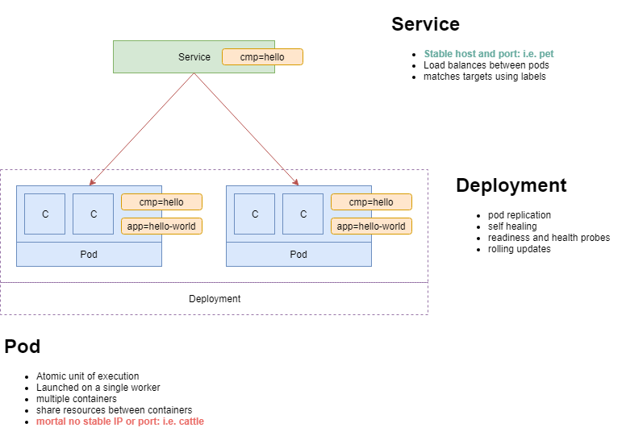

# Kubernetes Playground
This guide is a hands-on lab to cover the basic and intermediate concepts of Kubernetes (K8S or kate's).


## Prerequisites

The following tools need to be present on the development machine:

* [Docker](https://docs.docker.com/get-started)
* [Go](https://golang.org)
* [Kubectl](https://kubernetes.io/docs/tasks/tools/install-kubectl)

This guide assumes you understand the following concepts:

* Images and containers
* K8S deployments
* K8S services

## Chapter 0: Refresher



Very briefly, bottom-up:

* Pods
  * Are the atomic unit of execution and can execute on a single node.
  * Naked pods are seldom used.
  * Should not be targeted directly, because they are mortal and their IPs are not stable.
  * They can be tagged with labels.

* We use replica sets to deploy multiple replicas of identical hosts, in order to benefit from replication, self-healing, rolling updates, and probes.

* To expose the functionality of deployments we use a service.
  * Services have stable IPs and can be targeted.
  * Services match their pods using labels.
  * Services provide traffic load balancing.

## Chapter 1: Deploy a local cluster

* Install [KIND](https://kind.sigs.k8s.io/docs/user/quick-start/) (K8S IN Docker).
* Run `kind cluster create` to create a single node K8S cluster.
* Run `export KUBECONFIG=$(kind get kubeconfig-path) ` to point `kubectl` to your cluster.

### Checkpoint

* Running `kubectl config view` should output something like this:
```yaml
apiVersion: v1
clusters:
- cluster:
    certificate-authority-data: DATA+OMITTED
    server: https://localhost:41971
  name: kind
contexts:
- context:
    cluster: kind
    namespace: default
    user: kubernetes-admin
  name: kubernetes-admin@kind
current-context: kubernetes-admin@kind
kind: Config
preferences: {}
users:
- name: kubernetes-admin
  user:
    client-certificate-data: REDACTED
    client-key-data: REDACTED
```

* Running `kubectl cluster-info` should output something like this:

```bash
Kubernetes master is running at https://localhost:41971
KubeDNS is running at https://localhost:41971/api/v1/namespaces/kube-system/services/kube-dns:dns/proxy
```

## Chapter 2 - Coding HelloWorld images

### What we will do
Here's what we want to do:
* Create docker images of three ReST services
  * a multilang hello
  * a multilang world
  * a hello-world service that aggregates the message of the former two.
* Upload these images into our cluster

### Understanding the images
* We will use NodeJS as the programming language - anything works, but NodeJS ReST services can be written in almost a single line.
* We will create a `HelloWorld` distributed application - overengineered on purpose:
* The `Hello` service outputs `hello` in one of several languages.
* The `World` service outputs `world` in one of several languages.
* The `HelloWorld` service calls the above services, and aggregates their messages, and the languages used in them.
* The language can be configured through the `LANG` environment variable.
* The accompanying `build.sh` scripts simply build docker images.

### Building the images
* Run the `build.sh` scripts in each of the `hello`, `world`, and `hello-world` projects.

### Checkpoint
* Run `docker run -p 3000:3000 -d --name hello-multilang-container hello-multilang:1.0`
* curl `http://localhost:3000` should output something like this:
```json
{
  "greeting": "Hello",
  "lang": "en",
  "host": "d6c9dd84cd72"
}
```
* Run `docker rm -f hello-multilang-container` to forcefully stop and remove the container and free port 3000.

### Upload images into our cluster

* Run the three commands below to upload all three images in kind. This will make them visible by our K8S cluster
  * `kind load docker-image hello-multilang:1.0`
  * `kind load docker-image world-multilang:1.0`
  * `kind load docker-image hello-world-multilang:1.0`

This operation is available only through kind. A proper cluster can either pull from [DockerHub](https://hub.docker.com) or configured to pull from a private registry.

## Chapter 3 - Deploying the Hello service in K8S

### Deploying Hello

* Run `kubectl apply -f manifests/static/hello.yaml`

This will create a `deployment` with its pods and a `hello-service` that points to the pods of that deployment.

* The deployment manages the expected state of all pods that have the same label `component=hello`
* The service exposes port `9999` and routes traffic to port `3000` of the pods that match label `component=hello` in round-robin.

### Checkpoint

* Running `kubectl get pods` should output something like the below.
```bash
NAME                                READY   STATUS    RESTARTS   AGE
hello-deployment-577c6bfd4b-krvbh   1/1     Running   0          41s
hello-deployment-577c6bfd4b-qmf62   1/1     Running   0          41s
hello-deployment-577c6bfd4b-x9sp4   1/1     Running   0          41s
```

The number of `Running` pods should be equal to the replica count specified in the `manifests/static/hello.yaml` file.

* Running `kubectl get services` should output something like the below.

```
NAME            TYPE        CLUSTER-IP       EXTERNAL-IP   PORT(S)    AGE
hello-service   ClusterIP   10.100.243.216   <none>        9999/TCP   2m32s
```

This provides a few important pieces of information:

1. The hello service has a stable IP in the cluster that does not change - Unlike pods which are treated like `cattle`: they can fail or be killed off, they get a new IP and life goes on (and the service will detect this and adapt it's load balancing to include the new pods).
2. The hello service exposes port `9999` to other object in the cluster (such as pods and other services)
3. There is no external IP, so the service can't be accessed from outside, because the cluster does not have an ingress - i.e. a gateway into the cluster from the outside world, a.k.a. the internet.

* Running `kubectl describe service hello-service` should output something like the below.
```bash
Name:              hello-service
Namespace:         default
Labels:            app.kubernetes.io/name=hello
Selector:          component=hello

IP:                10.100.243.216
Port:              <unset>  9999/TCP
TargetPort:        3000/TCP
Endpoints:         10.244.0.100:3000,10.244.0.98:3000,10.244.0.99:3000
Session Affinity:  None
```

Notice the following:
* The `Selector` indicates how the services matches the pods to forward traffic to.
* The service exposes `Port` and forwards traffic to the `TargetPort` of the pods.
* `Endpoints` lists the IPs of the pods the service currently load balances between.

### Delete Hello

#### Option 1 - One at a time

* Run `kubectl delete service hello-world`
* Run `kubectl delete deployment hello-world`

This is the non-optimal way. Killing services and deployments one by one becomes more complicated for more evolved applications spanning multiple services.

#### Option 2 - Using Labels

* Run `kubectl delete services,deployments -l component=hello` meaning:

> kill all `services` and `deployments` that have the label `component=hello`

### Best Practices - Using Labels

* Labels tie pods to deployments and pods to services.
* Use labels to select which objects `kubectl` commands should apply to.
* Use label `app.kubernetes.io/name` ([common K8S label](https://kubernetes.io/docs/concepts/overview/working-with-objects/common-labels)) on all components of your application to group them under a single name.
* Use a label to groupd objects of each component of the application, like `component` or the common `app.kubernetes.io/component` label

## Chapter 4 - Deploying the entire HelloWorld application in K8S

* Run `kubectl apply -f manifests/static` to run all `yaml` manifests in the directory.

### Checkpoint

* Running `kubectl get all -l app.kubernetes.io/name=hello` should ouptput something like the below.

```bash
NAME                          TYPE        CLUSTER-IP       EXTERNAL-IP   PORT(S)    AGE
service/hello-service         ClusterIP   10.98.143.62     <none>        9999/TCP   25s
service/hello-world-service   ClusterIP   10.97.196.243    <none>        9999/TCP   26s
service/world-service         ClusterIP   10.109.233.122   <none>        9999/TCP   25s

NAME                                     READY   UP-TO-DATE   AVAILABLE   AGE
deployment.apps/hello-deployment         3/3     3            3           25s
deployment.apps/hello-world-deployment   1/1     1            1           26s
deployment.apps/world-deployment         2/2     2            2           25s
```

### Testing the application

As you know by now, there is no way into the kluster because there is no ingress.

* Run `kubectl port-forward service/hello-world-service 8888:9999` meaning
> Bind the machine port `8888` to port `9999` of `hello-world-service`

You should see something like this:
```
Forwarding from 127.0.0.1:8888 -> 3000
Forwarding from [::1]:8888 -> 3000
```

Why `3000`? Because the service forwards traffic from its port `9999` to port `3000` of the pods.
Basically we're forwarding traffic like this `127.0.0.1:8888 -> hello-world-service-9999 -> [pods-in-round-robin]:3000`

* Curl `http://localhost:8888` should output something like this:
```json
{
  "message": "Hello Mundo",
  "hosts": [
    "hello-deployment-577c6bfd4b-4rznd",
    "world-deployment-7c46854cf-wqjr7",
    "hello-world-deployment-6f6f7c6d5-prt9r"
  ],
  "langs": [
    "en",
    "es"
  ]
}
```

Things to notice:
* The service is using two languages, english and spanish, which makes for a weird aggregated message.
* This misconfiguration was on purpose, but happens way too often in real life.
* We want to fix that next by externalizing the configuration through `ConfigMaps`

### Deleting the application
* Run `kubectl delete all -l app.kubernetes.io/name=hello` to delete all deployments, services, and pods of the `hello` application.

## Chapter 5 - Using ConfigMaps to externalize configuration

### Deploying the application
* Run `kubectl apply -f manifests/configurable`

### Things to notice
#### The config map
* The `config-map.yaml` file specifies a `ConfigMap` resource named `hello-world-config`.
* The config map has a property `lang` set to `en`
* There are [many ways](https://kubernetes.io/docs/tasks/configure-pod-container/configure-pod-configmap/) to configure and use config maps.

#### The service manifests
* The `hello.yaml` and `world.yaml` manifests both have serctions that look like this:
  ```yaml
  env:
  - name: LANG
    valueFrom:
      configMapKeyRef:
        name: hello-world-config
        key: lang
  ```
  meaning 
  > Assign to env variable `LANG` the value of key `lang` in the config map named `hello-world-config`

### Checkpoint

* Running `kubectl get configmaps` should output something like this:
  ```
  NAME                 DATA   AGE
  hello-world-config   1      22h
  ```

* Running `kubectl get configmaps hello-world-config -o yaml` should output something like this:
  ```yaml
  apiVersion: v1
  data:
    lang: en
  kind: ConfigMap
  metadata:
    creationTimestamp: "2019-06-12T08:50:59Z"
    labels:
      app.kubernetes.io/name: hello
    name: hello-world-config
    namespace: default
    resourceVersion: "329612"
  ```
  The `data` part contains the configuration key-value pairs used in the services.

* Run `kubectl port-forward service/hello-world-service 8888:9999` to bind the service to you localhost on port 8888

* Curl `http://localhost:8888` should output something like this:
  ```json
  {
    "message": "Hello World",
    "hosts": [
      "hello-deployment-577c6bfd4b-4rznd",
      "world-deployment-7c46854cf-wqjr7",
      "hello-world-deployment-6f6f7c6d5-prt9r"
    ],
    "langs": [
      "en"
    ]
  }
  ```
  indicating that the application configuration is now consistent across services and return a message fully in english.

### Deleting the application
* Run `kubectl delete all -l app.kubernetes.io/name=hello`

### More things to notice

* Config maps are verbose.
* Plain and simple variable replacement/templating is not possible natively.
* Things could get quite complex if the application depends on other thirdparty services and deployments that need to be available in the cluster, for example a production-ready kafka.
* How can we package our application - services, deployments, and configuration included?
* How can we easily deploy our app with different configurations - DevOps anyone?

## Chapter 6 - Using Helm to configure our application

### What we want to do

* We want to leverage templates and variables to configure our manifests using Helm.
* We want to populate our templates with values and deploy to K8S.

### Who is Helm

* Helm is the linux's `apt-get` equivalent of K8S.
* Helm is java's `maven` equivalent of K8S.
* Helm does [a lot of things](https://helm.sh)


### Helm Charts

* Helm defines K8S distributed applications as `Charts`
* Each chart is a set of `templates` - basically YAML descriptors with Go templates inside of it.
* A Helm chart can depend on other charts.
* A Helm chart can be rendered with a default `values` YAML, or override these default values using an external file
* Helm can `install` a chart on K8S creating a `release`.
* Helm can `template` a chart on the client side by combining `templates + default-values + overriden-values` into a single YAML descriptor with the right values filled in.

### How we will use Helm 

* Helm version 2 comes as a client and a server (Tiller) that is installed on the K8S cluster
* Tiller is installed on K8S without any security considerations and poses a lot of security exploits, as described in this [Bitnami article](https://engineering.bitnami.com/articles/helm-security.html)
* We will not install Tiller
* We will use Helm's templating capabilities client side.
* Helm 3 - when GA - will no longer use Tiller.

### Things to notice
* We will be working with the `manifests/helm` directory which contains a `hello-chart`
* The `values.yaml` contains our `lang: fr` variable - among others
* The `hello.yaml` under `hello-chart/templates` - among others - contains variable templates like the below
  ```yaml
  env:
        - name: LANG
          value: {{ .Values.lang }}
  ```
  These will be replaced by Helm when templating by values coming from the `values.yaml` and `overrides.yaml`,

### Run the template 
* Install Helm as described [here](https://helm.sh/docs/using_helm/#installing-helm).
* Run `helm init --client-only` to initialize Helm.
* In the `helm` directory Run `helm template hello-chart -f overrides.yaml`
* This will combine the chart templates with the `values.yaml` and `overrides.yaml` to output a single descriptor to `sysout`

### Deploying the application

* Run `helm template hello-chart | kubectl apply -f -` to use only the default values without the overrides.

### Checkpoint

* Run `kubectl port-forward service/hello-world-service 8888:9999`
* Curl `http://localhost:8888` outputs something like this:
```json
{
  "message": "Bonjour Monde",
  "hosts": [
    "hello-deployment-75f76cdb59-77nwc",
    "world-deployment-8b8d48bc5-thg57",
    "hello-world-deployment-6f6f7c6d5-6x79v"
  ],
  "langs": [
    "fr"
  ]
}
```
* Run `kubectl describe deployment hello-deployment` should output something like this:
  ```bash
  Name:                   hello-deployment
  Selector:               component=hello
  Replicas:               1 desired | 1 updated | 1 total | 1 available | 0 unavailable
  Pod Template:
    Labels:  component=hello
    Containers:
    hello:
      Image:      hello-multilang:1.0
      Port:       3000/TCP
      Host Port:  0/TCP
      Environment:
        LANG:  fr
  ```
  indicating that the env variable `LANG` has properly been assigned the value `fr` from `values.yaml`.

### Deleting the application

* Run `kubectl delete all -l app.kubernetes.io=hello`


## Cleanup

* Run `kind delete cluster` to delete the local cluster.

## Where to go from here

There's quite a few things to cover, on the application side, like:
* Using volumes
* Adding an ingree like `nginx`
* Introducing a service mesh like `Istio`
* Adding a service gateway like `Kong`


On the tooling side:
* Using namespaces
* Writing `kubectl` plugins
* Writing custom controllers for K8S

Additional topics:
* Using K8S to run serverless lambdas through `OpenFaaS` or `Knative`
